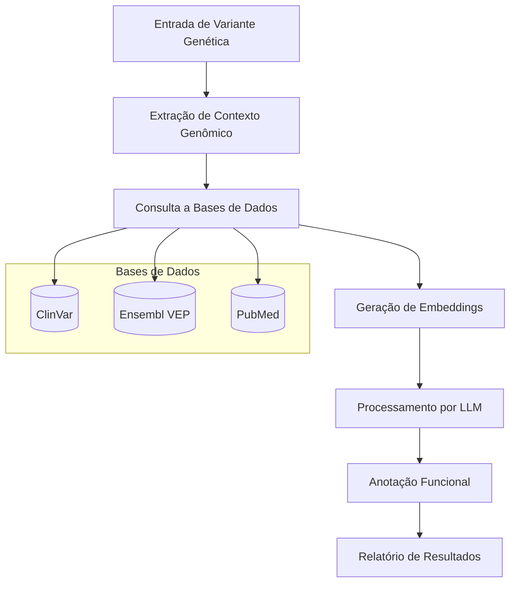
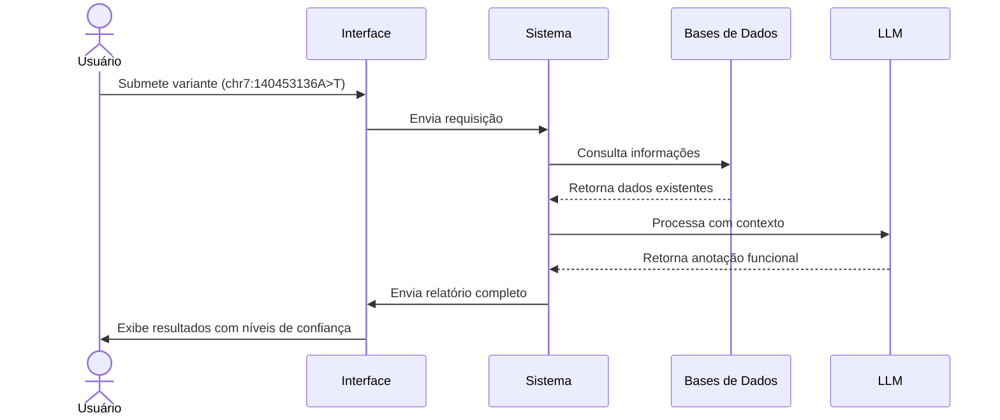

# Pré-Projeto: Sistema de Anotação Funcional de Variantes Genéticas com LLMs

## Fluxo Geral de Dados



## Exemplos de Usabilidade

1. **Caso Clínico**: Um geneticista identifica uma variante rara em um paciente com uma doença não diagnosticada. O sistema fornece possíveis implicações funcionais baseadas na literatura científica.

2. **Pesquisa**: Um pesquisador estuda variantes em regiões não codificantes. O sistema sugere possíveis mecanismos regulatórios baseados em dados publicados.

3. **Triagem**: Laboratórios de diagnóstico usam o sistema para priorizar variantes de significado incerto (VUS) para investigação adicional.

## Infraestrutura Necessária

1. **Hardware**:
   - Servidores GPU para processamento de LLMs
   - Armazenamento de alta capacidade para bases de dados genômicas
   - Sistemas de backup redundantes

2. **Software**:
   - Framework de LLM (PyTorch/TensorFlow)
   - LangChain para orquestração
   - BioBERT e PubMedGPT como modelos base
   - Sistema de banco de dados para armazenamento de variantes e anotações
   - API RESTful para integração com sistemas externos

3. **Dados**:
   - Acesso à ClinVar (variantes clínicas)
   - Acesso ao Ensembl VEP (predições de efeito)
   - Corpus de PubMed (literatura biomédica)
   - Dados de referência genômica (GRCh38)
  
| Nome             | Para que serve?                        | Tipo de dado       |
| ---------------- | -------------------------------------- | ------------------ |
| ClinVar          | Associa variantes a doenças            | Clínico/genético   |
| Ensembl VEP      | Prediz efeitos funcionais de variantes | Funcional/genético |
| Corpus de PubMed | Mineração de literatura biomédica      | Texto científico   |
| GRCh38           | Genoma humano de referência            | Sequência de DNA   |


## Pseudo-código do Sistema

```python
# Componente 1: Processador de Entrada de Variantes
def processar_variante(variante_id):
    # Formato de entrada: cromossomo, posição, referência, alternativa
    info_genomica = extrair_contexto_genomico(variante_id)
    return info_genomica

# Componente 2: Consulta a Bases de Dados
def consultar_bases_dados(info_genomica):
    resultados_clinvar = consultar_clinvar(info_genomica)
    resultados_vep = consultar_ensembl_vep(info_genomica)
    
    # Construir consulta para literatura
    termos_busca = gerar_termos_busca(info_genomica, resultados_clinvar, resultados_vep)
    artigos_relevantes = buscar_pubmed(termos_busca)
    
    return {
        "clinvar": resultados_clinvar,
        "vep": resultados_vep,
        "literatura": artigos_relevantes
    }

# Componente 3: Geração de Embeddings
def gerar_embeddings(info_genomica, resultados_db):
    # Gerar embeddings para a variante
    embedding_variante = biobert.encode(info_genomica)
    
    # Gerar embeddings para os resultados da literatura
    embeddings_literatura = []
    for artigo in resultados_db["literatura"]:
        embedding = biobert.encode(artigo.resumo)
        embeddings_literatura.append(embedding)
    
    return {
        "variante": embedding_variante,
        "literatura": embeddings_literatura
    }

# Componente 4: Processamento por LLM
def processar_com_llm(info_genomica, resultados_db, embeddings):
    # Construir prompt para o LLM
    prompt = construir_prompt(info_genomica, resultados_db)
    
    # Adicionar embeddings como contexto
    contexto = adicionar_contexto_embeddings(prompt, embeddings)
    
    # Processar com PubMedGPT
    resultado_llm = pubmedgpt.gerar_anotacao(contexto)
    
    return resultado_llm

# Componente 5: Geração de Relatório
def gerar_relatorio(info_genomica, resultados_db, resultado_llm):
    relatorio = {
        "variante": info_genomica,
        "anotacoes_existentes": {
            "clinvar": resultados_db["clinvar"],
            "vep": resultados_db["vep"]
        },
        "anotacao_llm": {
            "efeito_funcional_previsto": resultado_llm["efeito_funcional"],
            "mecanismo_proposto": resultado_llm["mecanismo"],
            "confianca": resultado_llm["score_confianca"],
            "referencias_suporte": resultado_llm["referencias"]
        },
        "timestamp": datetime.now()
    }
    
    return relatorio

# Fluxo Principal
def pipeline_anotacao_funcional(variante_id):
    # 1. Processar entrada
    info_genomica = processar_variante(variante_id)
    
    # 2. Consultar bases de dados
    resultados_db = consultar_bases_dados(info_genomica)
    
    # 3. Gerar embeddings
    embeddings = gerar_embeddings(info_genomica, resultados_db)
    
    # 4. Processar com LLM
    resultado_llm = processar_com_llm(info_genomica, resultados_db, embeddings)
    
    # 5. Gerar relatório
    relatorio = gerar_relatorio(info_genomica, resultados_db, resultado_llm)
    
    return relatorio
```

## Exemplo de Interface de Usuário



## Considerações Adicionais

1. **Validação**: Implementar sistema de validação cruzada com variantes conhecidas para avaliar precisão.

2. **Explicabilidade**: Incluir justificativas para cada anotação funcional sugerida.

3. **Atualização**: Estabelecer pipeline para atualização periódica dos modelos com novos dados da literatura.

4. **Ética e Privacidade**: Garantir conformidade com regulamentações de dados genéticos e saúde.

5. **Escalabilidade**: Projetar para processar lotes de variantes para estudos de exoma/genoma completo.