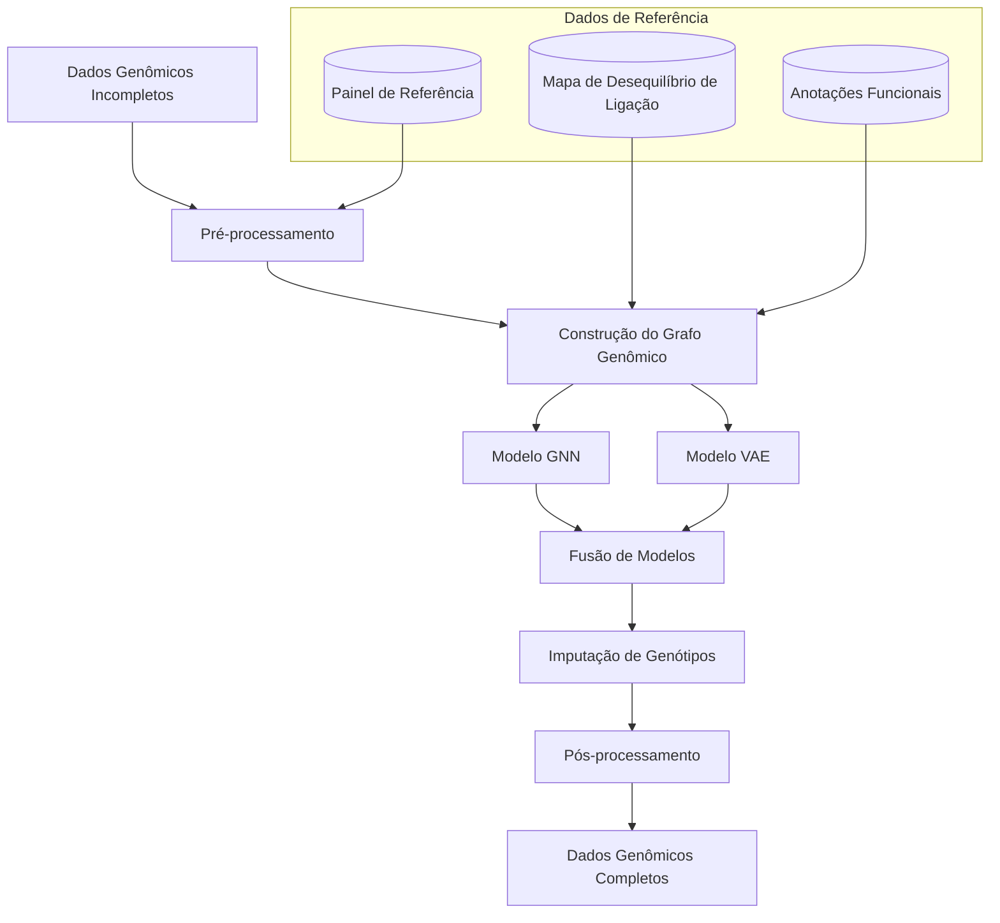
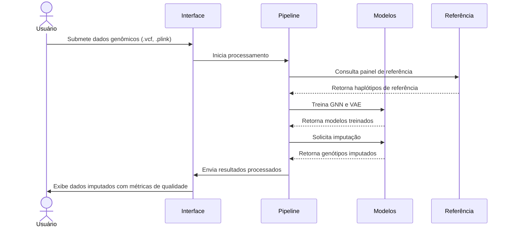

# Pré-Projeto: Sistema de Imputação de Dados Genômicos com GNNs e VAEs

## Fluxo Geral de Dados



## Exemplos de Usabilidade

1. **Estudos de Associação Genômica (GWAS)**: Pesquisadores podem imputar SNPs não genotipados em estudos de caso-controle, aumentando a cobertura genômica sem custos adicionais de genotipagem.

2. **Medicina de Precisão**: Clínicos podem obter genomas mais completos de pacientes a partir de dados de sequenciamento de baixa cobertura, permitindo melhor caracterização de variantes de risco.

3. **Estudos Populacionais**: Geneticistas populacionais podem reconstruir haplótipos ancestrais a partir de dados fragmentados de diferentes populações.

4. **Melhoramento Genético**: Pesquisadores em agricultura podem imputar marcadores genéticos em linhagens de plantas ou animais para seleção assistida por marcadores.

## Infraestrutura Necessária

1. **Hardware**:
   - Servidores com GPUs de alta performance (NVIDIA A100 ou similar)
   - Armazenamento de alta capacidade (>10TB) para painéis de referência
   - Cluster computacional para processamento paralelo de grandes conjuntos de dados

2. **Software**:
   - Framework de Deep Learning (PyTorch, PyTorch Geometric)
   - Bibliotecas para processamento de dados genômicos (Plink, BEAGLE, VCFtools)
   - Sistema de gerenciamento de workflows (Nextflow, Snakemake)
   - Ambiente de visualização de dados genômicos

3. **Dados**:
   - Painéis de referência (1000 Genomes, HapMap, TOPMed)
   - Mapas de desequilíbrio de ligação (LD)
   - Anotações funcionais genômicas (ENCODE, Roadmap Epigenomics)
   - Dados de estrutura populacional

## Pseudo-código do Sistema

```python
# Componente 1: Pré-processamento de Dados Genômicos
def preprocessar_dados(dados_genotipicos, painel_referencia):
    # Filtragem de qualidade, normalização e faseamento
    dados_filtrados = filtrar_por_qualidade(dados_genotipicos)
    dados_normalizados = normalizar_dados(dados_filtrados)
    dados_faseados = fasear_haplotipos(dados_normalizados, painel_referencia)
    
    return dados_faseados

# Componente 2: Construção do Grafo Genômico
def construir_grafo(dados_faseados, mapa_ld, anotacoes_funcionais):
    # Criar grafo onde nós são SNPs e arestas representam LD
    grafo = criar_grafo_vazio()
    
    # Adicionar nós (SNPs)
    for snp in dados_faseados.snps:
        grafo.adicionar_no(snp, atributos=extrair_atributos(snp, anotacoes_funcionais))
    
    # Adicionar arestas (relações de LD)
    for snp1, snp2, valor_ld in mapa_ld.pares:
        if valor_ld > LIMIAR_LD:
            grafo.adicionar_aresta(snp1, snp2, peso=valor_ld)
    
    return grafo

# Componente 3: Modelo GNN para Capturar Relações Estruturais
class ModeloGNN:
    def treinar(self, grafo, dados_conhecidos, dados_mascarados):
        # Inicializar camadas de GNN (Graph Convolutional Networks)
        self.conv1 = GraphConv(input_dim, hidden_dim)
        self.conv2 = GraphConv(hidden_dim, hidden_dim)
        self.conv3 = GraphConv(hidden_dim, output_dim)
        
        # Treinar modelo para prever genótipos mascarados
        for epoca in range(NUM_EPOCAS):
            # Propagação de mensagens pelo grafo
            h = self.conv1(grafo.nos, grafo.arestas)
            h = F.relu(h)
            h = self.conv2(h, grafo.arestas)
            h = F.relu(h)
            predicoes = self.conv3(h, grafo.arestas)
            
            # Calcular perda apenas nos nós mascarados
            perda = calcular_perda(predicoes[dados_mascarados], dados_conhecidos[dados_mascarados])
            perda.backward()
            otimizador.step()
    
    def prever(self, grafo, posicoes_ausentes):
        # Fazer predições para posições ausentes
        with torch.no_grad():
            h = self.conv1(grafo.nos, grafo.arestas)
            h = F.relu(h)
            h = self.conv2(h, grafo.arestas)
            h = F.relu(h)
            predicoes = self.conv3(h, grafo.arestas)
        
        return predicoes[posicoes_ausentes]

# Componente 4: Modelo VAE para Representação Latente
class ModeloVAE:
    def treinar(self, dados_faseados, dados_mascarados):
        # Inicializar encoder e decoder
        self.encoder = Encoder(input_dim, latent_dim)
        self.decoder = Decoder(latent_dim, input_dim)
        
        # Treinar modelo para reconstruir genótipos
        for epoca in range(NUM_EPOCAS):
            # Codificar para espaço latente
            mu, log_var = self.encoder(dados_faseados)
            z = reparametrizar(mu, log_var)
            
            # Decodificar para espaço original
            reconstrucao = self.decoder(z)
            
            # Calcular perda (reconstrução + KL divergence)
            perda_rec = calcular_perda_reconstrucao(reconstrucao, dados_faseados, dados_mascarados)
            perda_kl = calcular_kl_divergence(mu, log_var)
            perda = perda_rec + perda_kl
            
            perda.backward()
            otimizador.step()
    
    def prever(self, dados_parciais, posicoes_ausentes):
        # Codificar dados parciais
        mu, log_var = self.encoder(dados_parciais)
        z = reparametrizar(mu, log_var)
        
        # Decodificar para obter genótipos completos
        reconstrucao = self.decoder(z)
        
        return reconstrucao[posicoes_ausentes]

# Componente 5: Fusão de Modelos e Imputação Final
def imputar_genotipos(dados_incompletos, painel_referencia, mapa_ld, anotacoes_funcionais):
    # 1. Pré-processar dados
    dados_preprocessados = preprocessar_dados(dados_incompletos, painel_referencia)
    
    # 2. Identificar posições a serem imputadas
    posicoes_ausentes = identificar_posicoes_ausentes(dados_preprocessados)
    
    # 3. Construir grafo genômico
    grafo = construir_grafo(dados_preprocessados, mapa_ld, anotacoes_funcionais)
    
    # 4. Treinar modelos
    modelo_gnn = ModeloGNN()
    modelo_gnn.treinar(grafo, dados_preprocessados, ~posicoes_ausentes)
    
    modelo_vae = ModeloVAE()
    modelo_vae.treinar(dados_preprocessados, ~posicoes_ausentes)
    
    # 5. Fazer predições com ambos os modelos
    predicoes_gnn = modelo_gnn.prever(grafo, posicoes_ausentes)
    predicoes_vae = modelo_vae.prever(dados_preprocessados, posicoes_ausentes)
    
    # 6. Combinar predições (média ponderada pela confiança)
    confianca_gnn = calcular_confianca_gnn(predicoes_gnn)
    confianca_vae = calcular_confianca_vae(predicoes_vae)
    
    predicoes_combinadas = (predicoes_gnn * confianca_gnn + predicoes_vae * confianca_vae) / (confianca_gnn + confianca_vae)
    
    # 7. Pós-processar resultados
    dados_imputados = pos_processar(dados_preprocessados, posicoes_ausentes, predicoes_combinadas)
    
    return dados_imputados
```

## Exemplo de Interface de Usuário



## Considerações Adicionais

1. **Métricas de Qualidade**: Implementar r² (correlação ao quadrado), taxa de concordância e info score para avaliar a qualidade da imputação.

2. **Escalabilidade**: Desenvolver estratégias para lidar com genomas completos, como abordagem por janelas deslizantes ou processamento por cromossomo.

3. **Transferência de Aprendizado**: Explorar pré-treinamento em grandes painéis de referência e fine-tuning para populações específicas.

4. **Interpretabilidade**: Incorporar mecanismos para explicar a confiança nas imputações baseados na estrutura do grafo e na representação latente.

5. **Validação Cruzada**: Implementar esquemas de validação específicos para dados genéticos, como mascaramento aleatório de genótipos conhecidos.

6. **Integração com Ferramentas Existentes**: Desenvolver interfaces com ferramentas estabelecidas como BEAGLE, IMPUTE2 e Minimac para comparação e validação.