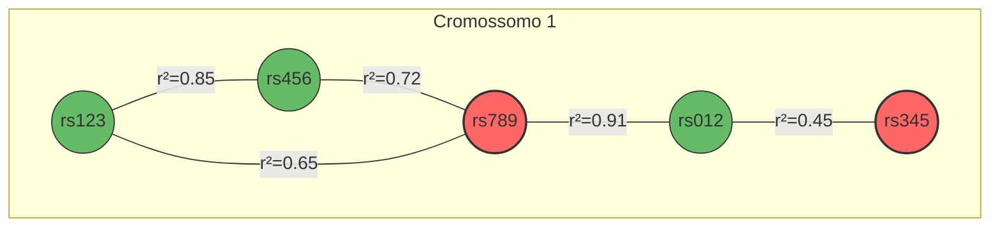
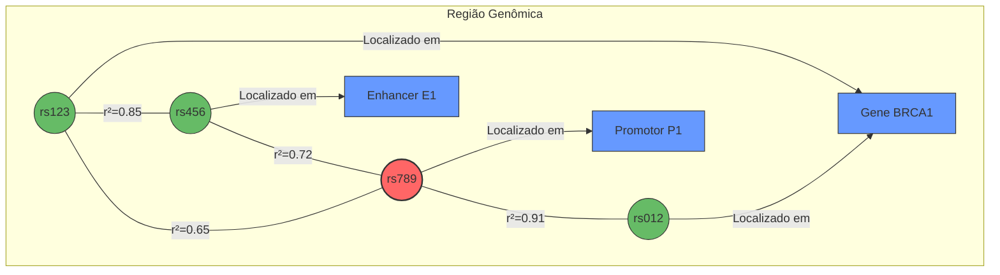
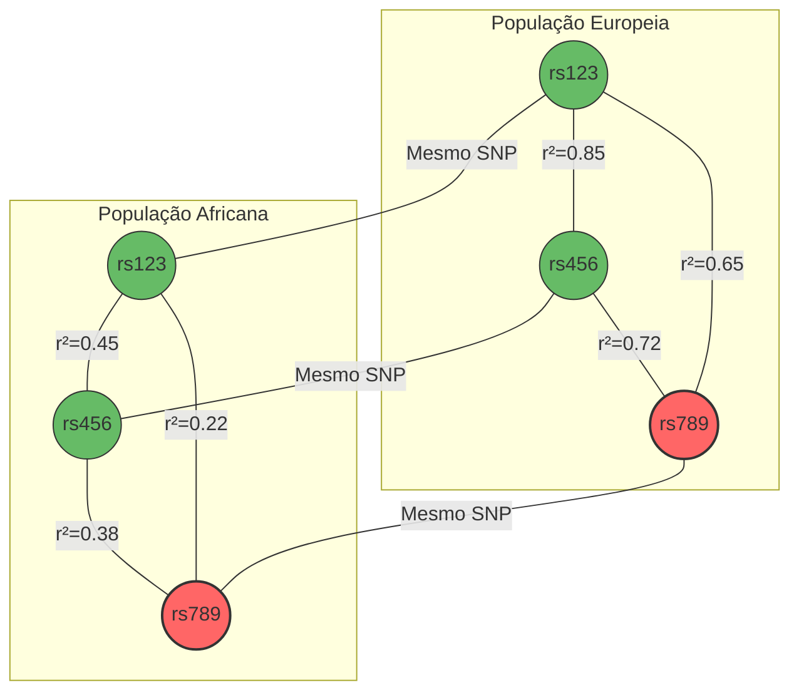
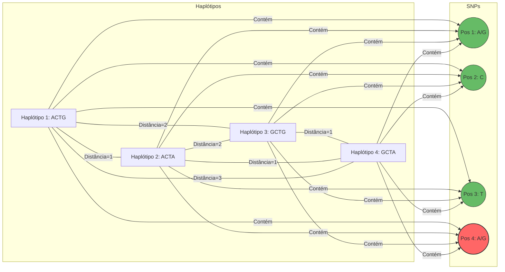
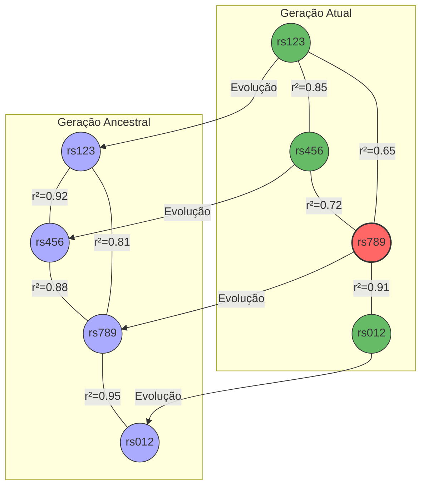
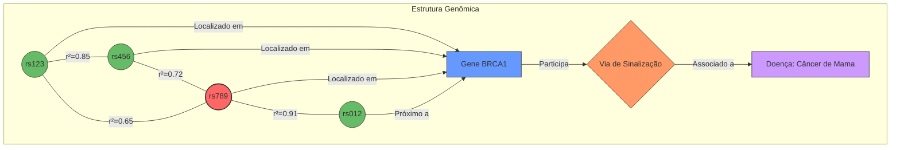
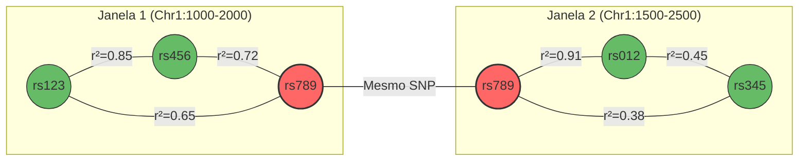

# Modelagem de Grafos para Imputação de Dados Genômicos

Este documento apresenta diferentes abordagens para modelar grafos genômicos no contexto do sistema de imputação de dados genômicos usando GNNs e VAEs.

## 1. Grafo baseado em Desequilíbrio de Ligação (LD)

*Neste modelo, os nós representam SNPs (polimorfismos de nucleotídeo único) e as arestas representam o desequilíbrio de ligação (r²) entre eles. Os nós vermelhos são SNPs desconhecidos que precisam ser imputados, enquanto os nós verdes são SNPs conhecidos.*

## 2. Grafo Hierárquico com Anotações Funcionais

*Este modelo incorpora informações funcionais, onde os SNPs estão conectados tanto por LD quanto por elementos genômicos funcionais (genes, enhancers, promotores). Esta estrutura permite que o GNN aprenda relações funcionais além das estatísticas.*

## 3. Grafo Multi-populacional

*Este modelo representa a estrutura de LD em diferentes populações, permitindo que o modelo aprenda padrões específicos de cada população e transfira conhecimento entre elas para melhorar a imputação.*

## 4. Grafo de Haplótipos

*Este modelo representa haplótipos (sequências de alelos em um cromossomo) como nós, com arestas representando a similaridade entre haplótipos. Os SNPs são conectados aos haplótipos que os contêm, permitindo a imputação baseada em estruturas de haplótipos completos.*

## 5. Grafo Espaço-Temporal para Recombinação

*Este modelo incorpora informações evolutivas, conectando SNPs entre gerações para capturar padrões de recombinação e deriva genética ao longo do tempo. Isso permite que o modelo aprenda como os padrões de LD mudam através das gerações.*

## 6. Grafo Heterogêneo com Múltiplos Tipos de Nós

*Este modelo heterogêneo integra múltiplos tipos de informação biológica, incluindo SNPs, genes, vias de sinalização e doenças. Esta abordagem permite que o GNN capture relações complexas entre diferentes entidades biológicas para melhorar a imputação.*

## 7. Grafo de Janela Deslizante para Processamento de Genoma Completo

*Este modelo representa uma abordagem de janela deslizante para processar genomas completos, onde janelas sobrepostas são modeladas como subgrafos conectados. Os SNPs que aparecem em múltiplas janelas servem como pontos de conexão, permitindo a propagação de informação entre janelas.*